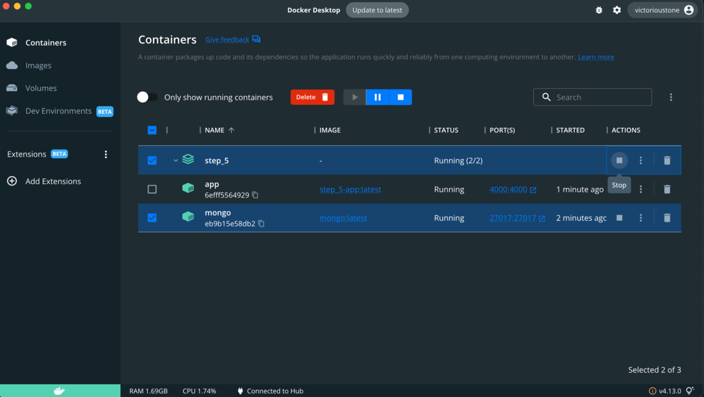

# server_pi

### Устанавливаем все необходимое
`npm install --global yarn <если еще не установлен> `   
`cd step_5 `   
`yarn install `   
[Docker desktop](https://www.docker.com/products/docker-desktop/) <если еще не установлен> 
### Работа с докером
`docker-compose build `    
`docker-compose up `  

  

### curl - на маке предустановлен, работа через консоль. 
#### Но можно вводить и через браузер
`curl -i localhost:4000/createEmployee `      
`curl -i localhost:4000/employees    `      
`curl -i localhost:4000/employeeById/<cюда _id сотрудника>   `       
`curl -i localhost:4000/deleteEmployeeById/<cюда _id сотрудника>  `        
`curl -i localhost:4000/deleteEmployees    `      
`curl -i localhost:4000/createGrade    `      
`curl -i localhost:4000/grades `      
`curl -i localhost:4000/gradeById/<cюда _id грейда> `      
`curl -i localhost:4000/deleteGradeById/<cюда _id грейда>`       
`curl -i localhost:4000/deleteGrades`      

### Немного о структуре данных
Данные лежат в [new_file.sql](new_file.sql).  
В папку models добавляется модель данных (каркас таблицы). Поле _id создается mongodb автоматически, и у него свой отдельный тип данных.  
В папке [controllers](step_5/controllers) прописываются функции, которые будут забираться router-ом в [server.js](step_5/server.js)

Сейчас создаются [dummy-data](step_5/dummy_data/db.js) для удобства отладки.  
